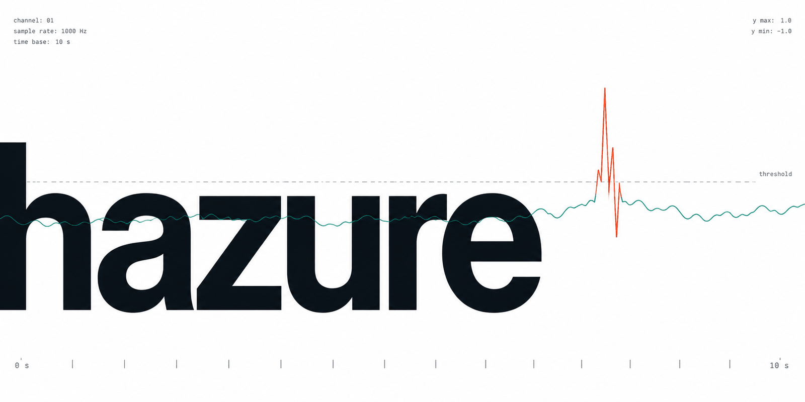

{ .hero width="720" }

You have a metric — requests per second, queue depth, a sensor reading — you
suspect it occasionally misbehaves, and you have no record of when it did.
`hazure` finds those moments: rule-based and unsupervised detectors that learn
what "normal" looks like from the series itself, and that say where it stopped
holding.

```bash
pip install hazure[pandas]
```

```python
import numpy as np
import pandas as pd
from hazure import detectors

index = pd.date_range("2024-03-01", periods=24 * 21, freq="h", name="time")
traffic = pd.Series(100 + 40 * np.sin(np.arange(504) / 3.8), index=index, name="rps")

labels = detectors.seasonal(period=24).fit_detect(traffic)
```

`labels` sits on the same time axis as `traffic`: `1.0` anomalous, `0.0` normal,
`NaN` unknown, in the same dataframe flavour it went in as. The
[quickstart](quickstart.md) plants a real anomaly and takes it from there.

## Shape of the library

Everything is a component with `fit` plus one verb:

| Type | Takes | Gives | Verbs |
| --- | --- | --- | --- |
| `Scorer` | a series | a continuous score | `.score()`, `.fit_score()` |
| `Threshold` | a score | binary labels | `.apply()`, `.fit_apply()` |
| `Detector` | a series | binary labels | `.detect()`, `.fit_detect()` |
| `Transformer` | a series | a series | `.transform()`, `.fit_transform()` |
| `Aggregator` | several columns | one column | `.aggregate()` |

Scoring and thresholding are separate because they answer separate questions:
one threshold policy is reusable across every scorer, a scorer can be swapped
without revisiting the policy, and a score is useful on its own for ranking.
A `Detector` is exactly one scorer and one threshold, and every function in
`hazure.detectors` returns one — so a ready-made detector can be printed,
reconfigured by name (`set_params(scorer__window=48)`) and stored, like one you
assembled yourself. `Pipeline` chains components; `Graph` wires them when the
model branches.

| Module | Holds |
| --- | --- |
| `hazure.detectors` | ready-made detectors, one function per kind of anomaly |
| `hazure.scorers` | continuous scores |
| `hazure.thresholds` | turning a score into labels |
| `hazure.transformers` | feature engineering and the rolling-window engine |
| `hazure.ensemble` | combining several verdicts or scores |

## Where the dependencies sit

`narwhals` and `numpy` at runtime, and nothing else. pandas, polars, pyarrow,
scipy, statsmodels, scikit-learn, stumpy, ruptures and matplotlib are extras,
imported lazily by the algorithms that need them — so importing `hazure` never
pulls in a plotting stack you were not going to use. Python 3.11 and newer, fully
typed, MIT licensed.

## Read next

- [Quickstart](quickstart.md) — one planted anomaly, end to end: generate,
  detect, convert to intervals, score, plot.
- [Guide](guide.md) — the component types, which detector suits which kind of
  anomaly, univariate versus multivariate, and the two behaviours that surprise
  people most.
- [How it works](algorithms/index.md) — the mathematics of every scorer,
  threshold and metric, and where each one's assumptions run out.
- [API reference](api.md) — every public name, module by module.
